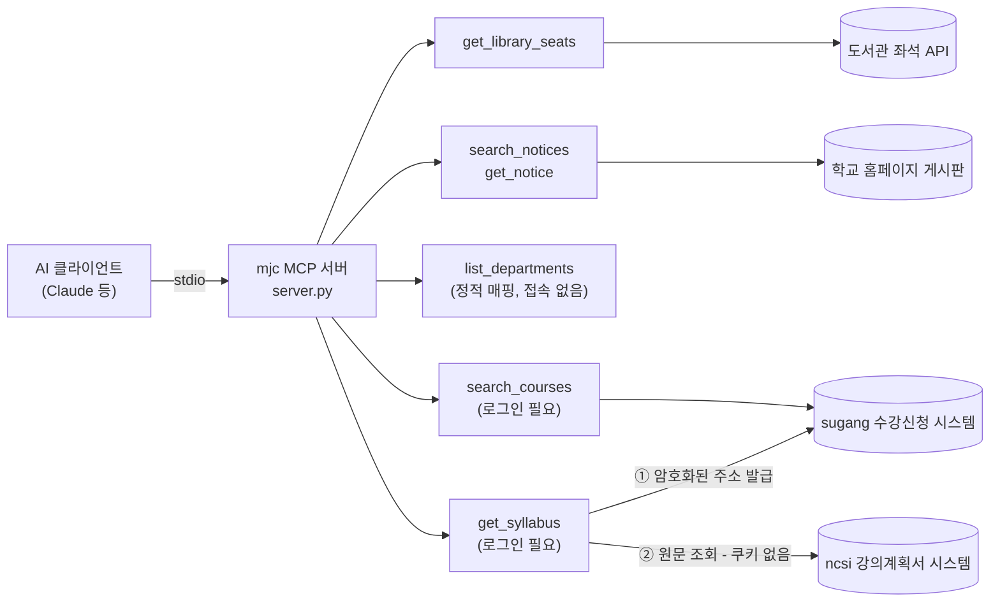
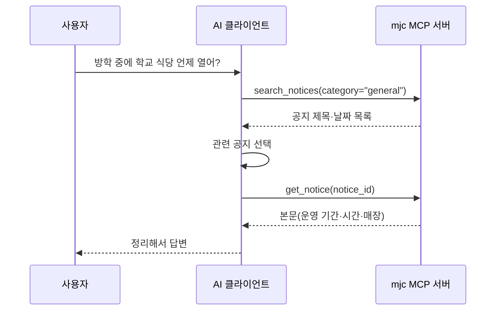
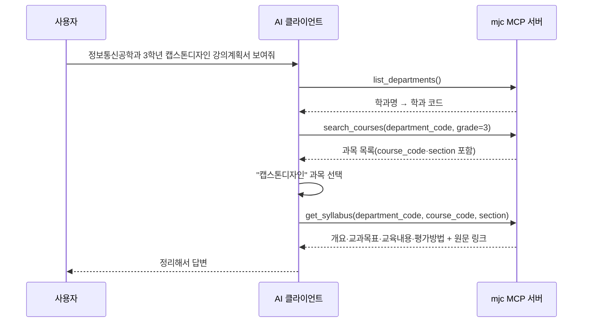
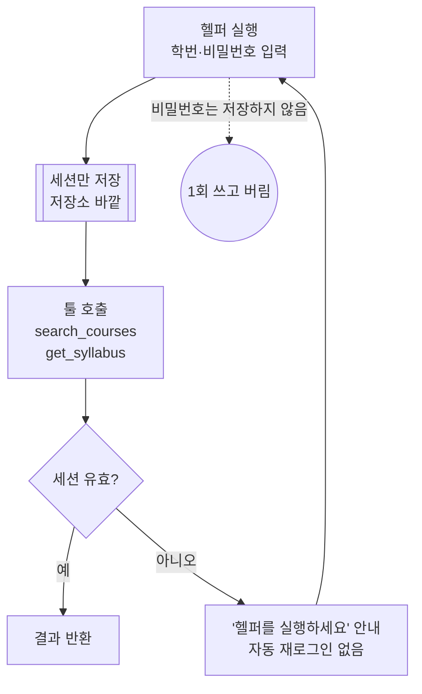

# 명지전문대 MCP 서버

**AI 에이전트가 명지전문대 학교 데이터를 직접 조회할 수 있게 해주는 어댑터입니다.**

"지금 도서관에 자리가 있는지", "이번 주 장학 공지가 무엇인지", "다음 학기 전공 강좌가 무엇인지"를
확인하려면 도서관 좌석 현황판·학교 홈페이지 게시판·수강신청 시스템을 각각 따로 방문해야
합니다. 각 시스템은 개별적으로는 잘 동작하지만, 서로 연결되어 있지 않고 AI 에이전트가 읽을
수 있는 형태로도 제공되지 않습니다.

그래서 학교 전용 챗봇 UI를 새로 만드는 대신, AI 에이전트가 이 데이터에 직접 접근할 수 있게
하는 어댑터를 만들었습니다. 학교가 자체 챗봇을 만들면 그 챗봇 안에서만 쓸 수 있지만,
MCP(Model Context Protocol)는 **규격**이라 Claude든 앞으로 나올 다른 AI 클라이언트든
설정 몇 줄만 추가하면 그대로 붙습니다. 우리가 미리 만들어두지 않은 질문에도
AI가 툴을 스스로 조합해 답합니다.

---

## 동작 방식



`get_syllabus`만 시스템 두 곳을 거칩니다. 인증된 sugang 세션으로 강의계획서 주소를
발급받은 뒤, 그 주소로 ncsi에서 원문을 가져옵니다 — 자세한 이유는
[docs/design.md](docs/design.md) 14장.

---

## 30초 설치

```bash
git clone https://github.com/4thIS/hachathon_mjc_mcp.git
cd hachathon_mjc_mcp
python -m venv .venv
.venv/Scripts/python -m pip install -r requirements.txt
```

AI 클라이언트 설정(`.mcp.json` 등)에 아래를 추가하고 클라이언트를 재시작합니다.
경로는 clone한 위치에 맞게 바꿔주세요.

```json
{
  "mcpServers": {
    "mjc": {
      "type": "stdio",
      "command": "C:\\경로\\hachathon_mjc_mcp\\.venv\\Scripts\\python.exe",
      "args": ["C:\\경로\\hachathon_mjc_mcp\\server.py"]
    }
  }
}
```

끝입니다. 도서관 좌석·공지·학과 목록 조회는 별도 계정이나 API 키가 필요 없습니다.
강좌 검색(`search_courses`)과 강의계획서 조회(`get_syllabus`)만 본인 학교 계정
로그인이 필요합니다 — 아래 "로그인이 필요한 툴 사용법" 참고.

> 요구 사항: Python 3.10 이상 (`mcp` SDK 요구 사항 기준. 개발·검증 환경은 3.14).
> macOS/Linux는 `command`를 `.venv/bin/python`으로 바꿉니다.

---

## 이렇게 물어보세요

**한 번에 답이 나오는 질문**

- "지금 도서관 어디가 제일 한산해?"
- "이번 주 학사공지 알려줘"
- "장학 공지 뭐 올라왔어?"
- "채용공지 최근 5개만 보여줘"
- "학교 일반 공지사항 뭐 있어?"

**AI가 툴을 엮어야 답이 나오는 질문** — 이게 이 프로젝트의 핵심입니다

| 질문 | AI가 엮는 툴 | 우리가 미리 안 알려줘도 되는 것 |
|---|---|---|
| "방학 중에 학교 식당 언제 열어?" | `search_notices` → `get_notice` | 어느 공지에 답이 있는지 |
| "지금 학교 가려는데, 도서관 자리 있고 밥 먹을 데 있어?" | `get_library_seats` + `search_notices` → `get_notice` | 질문 하나에 툴 3개가 필요하다는 것 |
| "채용공지 중에 이번 주 마감인 거 있어?" | `search_notices` → (필요 시) `get_notice` | 마감일이 제목에 있는지 본문에 있는지 |
| "정보통신공학과 3학년 전공 수업 뭐 있어?" | `list_departments` → `search_courses` | 학과 내부 코드 |
| "정보통신공학과 3학년 캡스톤디자인 강의계획서 보여줘" | `list_departments` → `search_courses` → `get_syllabus` | 학과 코드 · 과목 코드 · 분반 |

전부 우리가 미리 설계해둔 흐름이 아닙니다. AI가 툴 설명만 읽고 스스로 순서를 정합니다.
가장 짧은 흐름과 가장 긴 흐름을 펼쳐보면 이렇습니다.





---

## 제공하는 툴

| 툴 | 하는 일 | 주요 인자 | 데이터 출처 |
|---|---|---|---|
| `get_library_seats` | 열람실 3곳(집중학습공간·개방형학습공간·미디어실) 실시간 좌석 현황 | 없음 | 도서관 좌석 시스템 |
| `search_notices` | 공지 게시판 최신 글 목록 | `category`: `general`·`academic`·`scholarship`·`job` / `limit` | www.mjc.ac.kr 게시판 |
| `get_notice` | 공지 한 건의 본문, 첨부파일 목록, 본문 이미지 링크, 원문 페이지 주소 | `notice_id` (목록이 돌려준 값 그대로) | www.mjc.ac.kr 게시판 |
| `list_departments` | 학과 목록(이름·코드). 로그인 불필요 | 없음 | sugang(정적 매핑) |
| `search_courses` | 개설 강좌 검색. **로그인 필요** — 아래 참고 | `department_code`(목록이 돌려준 값), `course_type`, `grade`, `keyword` | sugang 수강신청 시스템 |
| `get_syllabus` | 강의계획서 조회(NCSI 연동). **로그인 필요** | `department_code`(list_departments가 준 값 — search_courses 호출에 쓴 것과 동일한 값), `course_code`·`section`(search_courses 결과 값) | ncsi.mjc.ac.kr |

모든 툴은 **읽기 전용**입니다(`read_only_hint=True`). 학교 시스템에 무언가를
쓰거나 바꾸는 동작은 없습니다.

### 로그인이 필요한 툴 사용법 (`search_courses`, `get_syllabus`)

비밀번호를 저장하지 않으므로, 세션이 없거나 만료되면 별도 터미널에서 직접 로그인해야 합니다.

```bash
.venv/Scripts/python auth/login_helper.py sugang
```



- 비밀번호를 어디에도 저장하지 않으므로, 교내 SSO 비밀번호가 90일마다 바뀌어도
  헬퍼를 다시 실행할 때 그 시점의 비밀번호를 입력하면 됩니다.
- `get_syllabus`는 sugang 세션을 그대로 재사용합니다 — NCSI(강의계획서 시스템)용
  별도 로그인이 필요 없습니다.

설계 의도 — 왜 목록과 상세를 나눴는지, 왜 게시판 내부 코드를 AI에게 숨기는지,
데모 중 서버가 죽어도 답이 나오게 한 캐시 폴백 구조 등 — 은
**[docs/design.md](docs/design.md)** 에 정리했습니다.

---

## 데이터 수집 원칙

| 원칙 | 지킨 방법 |
|---|---|
| 공개 페이지만 조회 | `search_courses`·`get_syllabus`만 예외로 사용자 본인 계정 로그인이 필요합니다 |
| `robots.txt` 확인 | `www.mjc.ac.kr` 전면 허용(`Allow: /`, 2026-08-06). `sugang.mjc.ac.kr`은 `robots.txt` 자체가 없음(2026-08-07, 허용도 거부도 아닌 상태) |
| 부하를 주지 않음 | 동일 호스트 연속 요청 사이 **최소 1초 간격**. 사람이 브라우저로 쓰는 것보다 빈번하게 호출하지 않습니다 |
| 신원을 밝힘 | User-Agent에 프로젝트를 식별할 수 있는 값(`MJC-MCP/0.1 (+저장소 주소)`)을 보냅니다 |
| 외부 전송 없음 | 조회 결과는 사용자의 AI 클라이언트에만 전달됩니다. 로컬 캐시는 데모 중 장애 대비용이며 저장소에 포함되지 않습니다 |
| 자격증명 미포함 | 저장소에 계정·비밀번호·세션이 없습니다. 비밀번호는 디스크에 저장하지 않고 세션만 저장소 바깥에 두며, 자동 재로그인도 하지 않습니다 |
| 개인정보는 **읽지도 않음** | 강의계획서 원문의 담당교수 전화·이메일은 응답에서 빼는 데 그치지 않고, 파서가 해당 칸의 값을 읽지 않고 건너뜁니다 |
| 운영 전제 | 실제 서비스로 운영하려면 **학사팀 협의가 전제**입니다 |

---

## 한계 (정직하게)

| 한계 | 어떻게 되는가 |
|---|---|
| 게시판 페이지네이션 미지원 | 각 게시판의 첫 페이지 범위 안에서만 조회됩니다. 오래된 공지는 찾지 못합니다 |
| 본문이 이미지인 공지 | 텍스트를 추출할 수 없습니다. 그 사실을 알리는 문구와 함께 이미지 링크(`body_images`)·원문 주소(`source_url`)·첨부파일 목록을 돌려줍니다 — 지어내지 않고 사람이 직접 보게 넘깁니다 |
| 본문 4000자 초과 | 잘립니다. `truncated` 필드로 알려, AI가 잘린 내용을 전체처럼 인용하지 않게 합니다 |
| 학교 사이트 구조 변경 | 파싱이 깨집니다. 다만 파싱 계층을 분리해 해당 툴 파일 하나만 고치면 되게 했습니다 |
| 실시간 신청 인원 | 제공하지 않습니다. sugang이 목록 응답에 담지 않고 별도 새로고침을 요구합니다 — 정원(`capacity`)까지만 제공합니다 |
| 로그인 필요 툴의 세션 | 사용자가 헬퍼를 먼저 실행해야 하고, 만료 시 자동 재로그인 없이 안내만 돌려줍니다 |
| `get_syllabus`가 담는 범위 | 핵심 필드만 구조화합니다. 주차별(15주) 계획·교재·장애학생 지원 안내·담당교수 연락처는 담지 않습니다 — `source_url`에서 원문을 확인하세요 |
| 추가 시스템 연동 | 보류했습니다. E-class(`cyber.mjc.ac.kr`)는 `robots.txt`가 전면 거부, 커리어정보(`mpu.mjc.ac.kr`)는 조사 결과 E-class에 내장된 제3자 벤더 시스템이었습니다. 자격증명 취급 원칙은 [docs/design.md](docs/design.md) 8장 |
| 도서관 좌석 API 도달성 | 비표준 포트를 써서 일부 제한된 네트워크(게스트 Wi-Fi 등)에서는 도달하지 못할 수 있습니다 |

---

## 개발

```bash
.venv/Scripts/python -m pytest tests/ -v
```

파서 테스트는 실제 응답을 **bytes 원본**으로 저장한 fixture를 사용합니다.
텍스트로 저장하면 인코딩 버그를 감추기 때문입니다.

```
server.py        진입점. 각 툴 모듈의 register(mcp) 호출만 한다
common/          http · parse · cache · errors · models · session (공통 레이어)
auth/            login_helper.py — 독립 CLI, 사용자가 직접 실행
tools/           library_seats.py, notices.py, departments.py, course_search.py, syllabus.py
tests/fixtures/  실제 응답 원본
docs/design.md   설계 문서
```

---

## 팀

| GitHub | 역할 |
|---|---|
| [@Hyeon02-kr](https://github.com/Hyeon02-kr) | 팀장 · 공통 레이어 · 로그인 인프라 · 서버 통합 |
| [@ghl0801](https://github.com/ghl0801) | 도서관 좌석 툴 · 학과 목록 툴 |
| [@mnzsuu](https://github.com/mnzsuu) | 공지 게시판 툴 · 강좌 검색 툴 |

2026년 명지전문대 캡스톤 경진대회 출품작.
